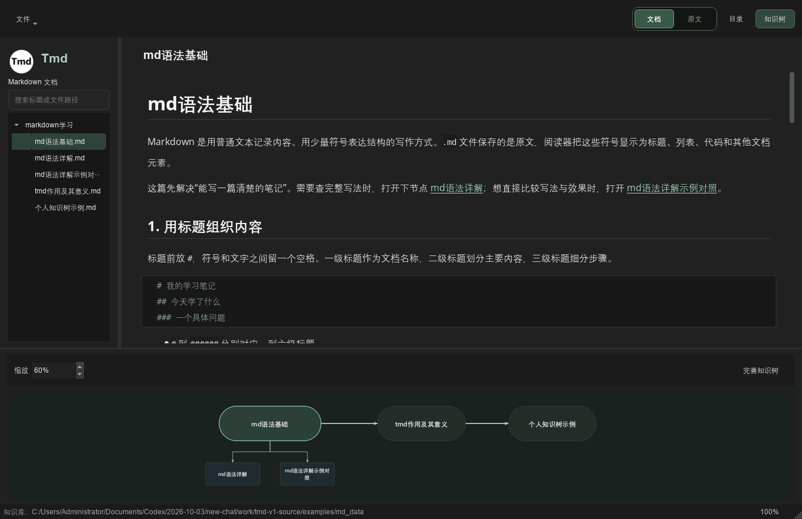
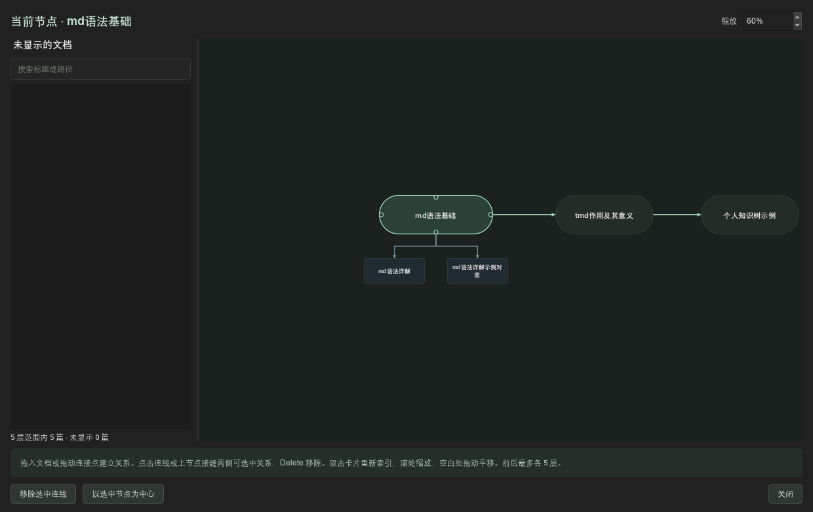

# Tmd

**用 Markdown 写知识，用知识树连接学习过程。**  
**Write knowledge in Markdown. Connect your learning with a knowledge tree.**

[版本 / Releases](https://github.com/HuTaoUnknow/Tmd/releases/latest) · [安装包 / Installer v1.0.1](https://github.com/HuTaoUnknow/Tmd/releases/tag/v1.0.1) · [中文教程](docs/使用教程.md) · [English guide](docs/USER_GUIDE.md) · [安装说明 / Installation](docs/INSTALLATION.md) · [构建 / Build](docs/BUILDING.md)

当前源码为 **v1.0.2（第三版）**，本次发布源码，不包含新版安装包或便携包。现有 Windows 安装包仍为 v1.0.1，使用第三版请从源码构建。

Current source: **v1.0.2, the third release**. This release contains source code only; Windows installer and portable downloads remain at v1.0.1. Build from source to use the new version.



## 中文

### 简介

Tmd 是一个 Windows 桌面 Markdown 知识库。每篇真实的 `.md` 文档都是一个知识节点：用前后关系表达学习路线，用上节点表达可替换的知识，用下节点补充详解、案例和实践。

文件夹帮助找到文档，知识树帮助理解文档之间的联系。正文、图片和关系数据都保存在本地，能够自行查看和备份。Tmd 无需账号即可编辑本地文档；访问网络图片时需要网络。

### 功能

- **文档与原文**：在可编辑的排版结果和完整 Markdown 原文之间切换，共享保存与撤销记录。
- **常用 Markdown**：标题、强调、代码、列表、任务列表、表格、引用、链接和图片。
- **知识树**：从当前文档索引最多五层关系，前后互相联动，同级替代共享路线，下节点支持嵌套；切换中心保留已有树形和连线位置。
- **拖放整理**：在“完善知识树”中拖入文档，落点预显示关系，选中连线后可移除。
- **图片管理**：粘贴或拖入图片，默认复制到对应的 `md_photo` 目录；支持相对路径、绝对路径、网络图片链接。
- **携带图片导出**：导出 Markdown 时可复制图片到导出文档同级目录，改写导出副本的相对地址。
- **阅读与检索**：标题目录、快速搜索、窄窗口侧栏收起，以及独立的正文和知识树缩放。
- **文件列表右键**：重命名或回收点击的文档、新建文件夹、递归回收目录；空文件夹也能显示，删除统一进入 Windows 回收站。
- **MD加载样式**：五组折叠设置调整字体、标题、缩进、代码与表格样式；支持代码语言补全及十六进制 TXT 配置导入、导出。
- **图片保存方式**：独立窗口设置相对位置、绝对位置，管理命名图床链接；预留可配置上传接口。

### 安装与第一次使用

1. 在 [v1.0.1 安装包](https://github.com/HuTaoUnknow/Tmd/releases/tag/v1.0.1) 下载 `Tmd-1.0.1-Windows-x64-Setup.exe`。以下安装步骤适用于该版本，v1.0.2 需从源码构建。
2. 选择安装语言与安装范围，默认仅为当前用户安装。
3. 设置应用登记名称（默认 `Tmd`）、程序安装位置和开始菜单文件夹。
4. 选择是否创建桌面快捷方式、开始菜单快捷方式，以及是否登记到 Windows 已安装的应用列表。
5. 完成安装后启动 Tmd，打开 `markdown学习` 中的入门文档。

安装版首次启动会在系统“文档”目录下创建 `Tmd` 知识库。升级和卸载保留这里的个人文档与图片。程序运行依赖随安装包提供，无需另外安装 Qt 或编译器。

也提供 `Tmd-1.0.1-Windows-x64-Portable.zip`：完整解压到可写目录后运行 `tree_md.exe`，知识库位于程序旁的 `md_data` / `md_photo`。详细步骤、备份和静默安装见 [安装说明](docs/INSTALLATION.md)。

### 内置示例

```text
md语法基础 → tmd作用及其意义 → 个人知识树示例
    ├─ md语法详解
    └─ md语法详解示例对照
```

个人知识树示例通过一个学习任务应用，描述从 Java、数据库和后端接口，到 HTML/CSS、JavaScript、前后端联调与组件化的学习过程。



### 使用要点

新建、导入、保存、另存为、导出、重命名、删除和刷新在“文件”菜单中。“设置”包含“MD加载样式”“图片保存方式”和“关于 Tmd”。右侧“文档 / 原文”切换显示方式，“目录”控制标题导航，“知识树”展开当前文档的关系。

按 `Ctrl+P` 搜索，`Ctrl+S` 保存，`Ctrl+滚轮` 调整正文大小（50%～200%），`Ctrl+0` 恢复 100%。知识树有独立的缩放控制并保存上次倍率。完整操作和关系示例见 [中文使用教程](docs/使用教程.md)。

### 当前范围

v1.0.2 面向 Windows 10/11 的 64 位桌面环境，已在 Windows 11 完成本地构建与检查。应用界面目前为简体中文，项目文档提供中英文。图床可管理已有图片链接，也提供通用上传配置接口；尚未连接真实图床验证，服务兼容性需要反馈。数学公式、Mermaid 和脚注不作为本版完整支持的语法。源码和构建脚本可用于继续开发。

## English

### Overview

Tmd is a Windows desktop knowledge library built around real Markdown files. Each `.md` document is a knowledge node. Previous/next relationships form learning routes, alternative nodes represent interchangeable approaches, and detail nodes hold explanations, examples and practice.

Folders organize files; the knowledge tree describes how their contents relate. Documents, images and relationships remain local and can be inspected or backed up directly. No account is required for local editing. Remote images require a network connection.

### Features

- Switch between an editable rendered document and its complete Markdown source, with shared save and undo history.
- Read and write headings, emphasis, code, lists, task lists, tables, quotes, links and images.
- Explore up to five relationship steps from the current document. Learning routes are reciprocal, alternatives share routes, and detail nodes can be nested. Changing the center preserves the existing layout and connector positions.
- Drag documents into the knowledge tree, preview the relationship before dropping, and remove selected connections.
- Paste or drop images. Relative storage is the default, with absolute paths and remote image URLs also available.
- Export Markdown with its images beside the exported file, rewriting image paths in the exported copy.
- Use heading navigation, quick search, responsive sidebars and separate text/tree zoom controls.
- Manage documents and folders from the sidebar context menu. Empty folders are visible; document and recursive folder removal use the Windows Recycle Bin.
- Customize fonts, headings, indentation, code and tables through five collapsible Markdown style sections; complete fenced-code languages and import/export hexadecimal TXT configuration.
- Configure relative and absolute image locations in a separate window, manage named image URLs and configure a generic upload interface.

### Install and start

1. Download `Tmd-1.0.1-Windows-x64-Setup.exe` from the [v1.0.1 installer release](https://github.com/HuTaoUnknow/Tmd/releases/tag/v1.0.1). The following installation steps apply to that version; v1.0.2 requires building from source.
2. Select the installer language and installation scope; current-user installation is the default.
3. Choose an application display name, installation directory and Start menu folder.
4. Select desktop/Start menu shortcuts and optional registration in Windows Installed apps.
5. Launch Tmd and open the included `markdown学习` learning examples.

On first launch, the installed application creates its library under **Documents/Tmd**. Upgrades and uninstalling preserve this user library. Qt and compiler runtimes are bundled; users do not need a development environment.

For portable use, extract `Tmd-1.0.1-Windows-x64-Portable.zip` into a writable directory and run `tree_md.exe`. Its `md_data` and `md_photo` folders stay beside the executable. See [Installation](docs/INSTALLATION.md) for migration, backup and command-line options.

### Quick workflow

Use the **文件 (File)** menu for document operations. **设置 (Settings)** contains **MD加载样式 (Markdown loading styles)**, **图片保存方式 (Image storage)** and **关于 Tmd (About Tmd)**. **文档 (Document)** shows the editable rendered result, **原文 (Source)** shows Markdown text, **目录 (Outline)** opens heading navigation, and **知识树 (Knowledge tree)** displays related documents.

Press `Ctrl+P` to search, `Ctrl+S` to save, `Ctrl+mouse wheel` to zoom text from 50% to 200%, and `Ctrl+0` to reset it. Tree zoom is independent and remembers its last setting. See the [English user guide](docs/USER_GUIDE.md) for a complete tutorial.

### Release scope

v1.0.2 targets 64-bit Windows 10/11 and has been built and checked locally on Windows 11. The application UI and starter documents are currently in Simplified Chinese; project documentation is bilingual. Image hosting supports saved URLs and a configurable generic upload interface. No real hosting provider has been tested, so provider compatibility remains unverified. Math, Mermaid diagrams and footnotes are not guaranteed to render fully in this release.

## Development and licensing

Built with C++17, Qt Widgets and CMake. See [BUILDING](docs/BUILDING.md) for Qt Creator, command-line builds, tests and installer generation.

Tmd code and original documentation are licensed under [MIT](LICENSE). Qt, bundled fonts, compiler runtimes and installer components retain their own licenses. Read [Third-party notices](THIRD_PARTY_NOTICES.md); license texts are distributed in `licenses/`.

Report reproducible issues through [GitHub Issues](https://github.com/HuTaoUnknow/Tmd/issues), including the Tmd version, Windows version and steps to reproduce. Remove private document content from shared examples.
